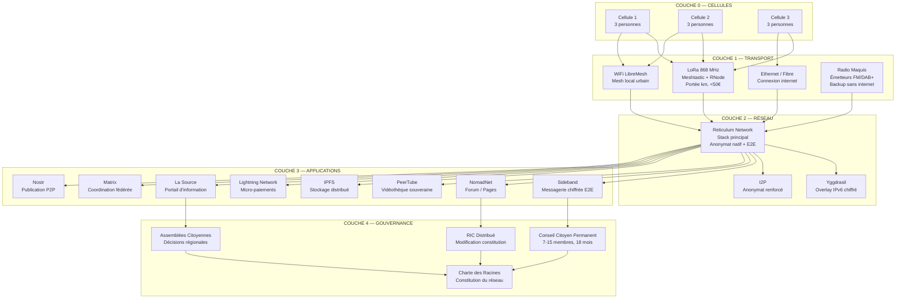
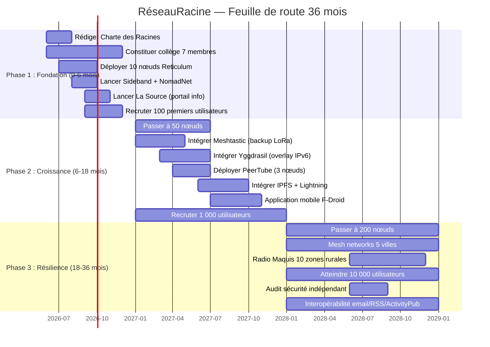
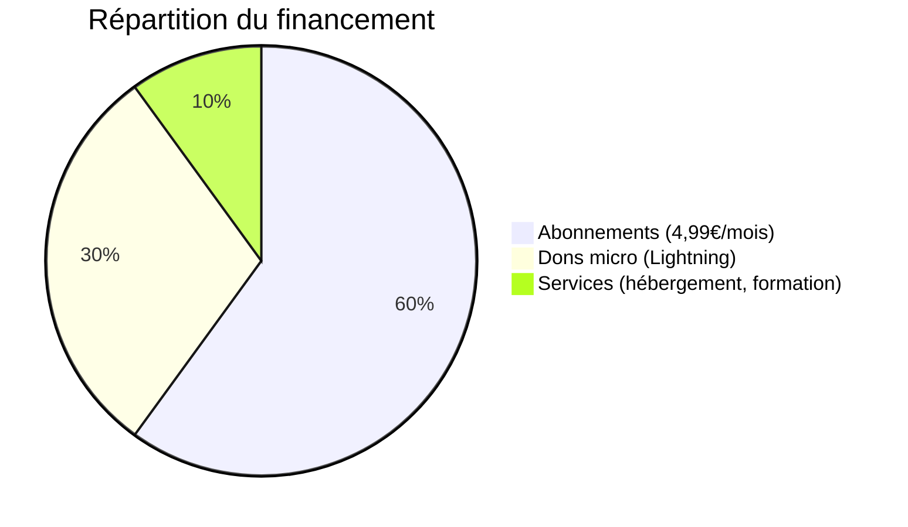
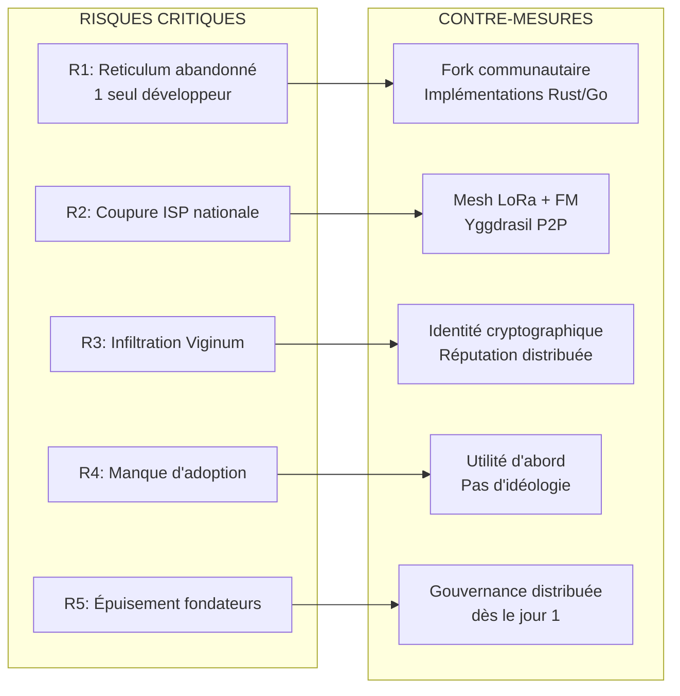

# RéseauRacine — Vision & Dashboard

> **Un réseau que le système ne peut ni censurer, ni absorber, ni couper.**

---

## Vision

Le système contemporain ne censure pas — il absorbe. Il ne supprime pas — il rend dépendant. Toute opposition qui circule sur YouTube, X, Facebook, Substack, ou qui dépend des aides publiques, des sondages IFOP, ou des milliardaires du mégaphone est mécaniquement absorbable.

**RéseauRacine** est l'infrastructure souveraine qui brise cette absorption. Ce n'est pas un réseau social alternatif. Ce n'est pas une plateforme de dissidence. C'est un **protocole de souveraineté** — un ensemble de technologies, de gouvernance et de principes qui permettent à des citoyens de communiquer, publier, coordonner et financer — sans aucune dépendance aux GAFAM, à l'État, ou au capital profond.

Le nom vient de Simone Weil : *« L'enracinement est peut-être le besoin le plus important et le plus méconnu de l'âme humaine. »* Le réseau ne vise pas l'autonomie (fantasme) mais la **polydépendance réelle** — dépendre de ses pairs, de la matière, du temps, de la terre, pas des algorithmes.

---

## Diagnostic — 6 couches de dépendance actuelles

| Couche | Dépendance actuelle | Vecteur d'absorption | Alternative souveraine |
|--------|-------------------|---------------------|----------------------|
| **Hébergement** | AWS, Google Cloud, OVH (loi française) | Coupure administrative, réquisition | Auto-hébergement distribué + YunoHost/Sandstorm |
| **Distribution** | YouTube, X, Facebook, App Store, Play Store | Dépriorisation algorithmique, bannissement | F-Droid + PWA + APK direct + IPFS |
| **Financement** | Subventions publiques, Tipeee, publicité | Asphyxie, conditionnement idéologique | Abonnements + Lightning + SCOP |
| **Identité** | Email GAFAM, numéros de téléphone | Désactivation, surveillance | Clés cryptographiques (PGP/Nostr) + Session |
| **Communication** | Telegram, WhatsApp, Signal (entreprises centralisées) | Blocage ISP, pression juridique | Reticulum (Sideband) + Matrix + Session |
| **Coordination** | Discord, Slack, Google Docs | Fermeture de compte, censure | CryptPad + Loomio + NomadNet |
| **Connectivité** | ISP unique (Orange, Free, SFR, Bouygues) | Coupure nationale | Mesh LoRa + Starlink (backup satellite) + Yggdrasil P2P |

**Le système n'a pas besoin de censurer. Il lui suffit de contrôler une couche.**

---

## Les 5 circuits de capture → Les 5 brisures

| Circuit de capture (Effondrement structurel) | Brisure par RéseauRacine |
|---------------------------------------------|-------------------------|
| **Interne** : ENA → pantouflage → lobbying → médias | Gouvernance distribuée, pas de leader, 6 règles du ré-enracinement |
| **Externe** : Françafrique → prédation → blanchiment | Hébergement multi-juridictions (France + Suisse + Islande) |
| **Reproduction** : éducation → illettrisme → ENA | Formation à l'auto-hébergement, transmission à 1 personne |
| **Spoliation** : 486 taxes, 63% écrasement fiscal | Financement distribué, plafond 5% par contributeur, SCOP |
| **Vide** : État absent, 78% défiance | Mesh networks locaux, Radio Maquis, résilience sans ISP |

---

## 6 principes de conception

| # | Principe | Signification |
|---|----------|---------------|
| 1 | **Redondance par la distribution** | Aucun point de contrôle unique. Si un nœud tombe, le réseau continue. |
| 2 | **Souveraineté par l'indépendance économique** | Zéro subvention publique. Zéro dépendance à un seul financeur. |
| 3 | **Résilience par l'interopérabilité** | Le réseau est un protocole, pas une plateforme. Comme l'email. |
| 4 | **Invisibilité par la normalité** | Le réseau ne ressemble pas à une « dissidence ». Il ressemble à un outil normal. |
| 5 | **Capture-proof par la gouvernance distribuée** | Pas de leader. Cellules de 3, essaims de 10. Code open-source, auditabilité totale. |
| 6 | **Polydépendance, pas autonomie** | Dépendre de ses pairs, de la matière, du temps — pas des algorithmes. |

---

## Architecture en un coup d'œil

---

## Stack technologique détaillé

### Reticulum — Stack principal

**Pourquoi Reticulum** : seul stack réseau complet offrant anonymat natif (pas d'adresses source), chiffrement E2E par défaut, forward secrecy, adresses auto-souveraines et portables, et support multi-transport (150 bps → 500 Mbps). 2 816 commits, API stable, wire-format stable.

**Interfaces supportées** : Ethernet/WiFi, LoRa (RNode), Packet Radio (AX.25, TNC), I2P, TCP/UDP, ports série, programmes externes (stdio/pipes).

**Écosystème d'applications Reticulum** :

| Application | Usage | Plateforme |
|-------------|-------|------------|
| **Sideband** | Messagerie LXMF, appels voix, télémétrie, maps offline | Android, Linux, macOS, Windows |
| **NomadNet** | Réseau mesh off-grid, pages browsables, forum | Linux, macOS, Windows |
| **Columba** | Messagerie LXMF simple, Material Design 3 | Android |
| **MeshChatX** | Client LXMF complet, voicemail, phonebook, maps | Linux, macOS, Windows |
| **Reticulum Relay Chat** | Chat temps réel over Reticulum | Web, GUI |
| **rncp** | Transfert de fichiers | CLI |
| **rnsh** | Shell interactif distant | CLI |
| **rnx** | Exécution de commandes distantes | CLI |
| **rngit** | Serveur Git over Reticulum | CLI |

**Limitations connues** : référence Python (pas idéal mobile/embedded), implémentations Rust/C++/Zig/Go en cours, pas de group chats natifs, communauté petite (1 dev principal — Markqvist).

### Tableau complet

| Couche | Technologie | Rôle | Statut | Limitations connues |
|--------|------------|------|--------|-------------------|
| **Physique** | LoRa (Meshtastic + RNode) | Mesh off-grid, portée km | ✅ 1 849 nœuds France, 50 000+ monde | Texte seul, scalabilité limitée |
| **Physique** | WiFi (LibreMesh/OpenWrt) | Mesh local urbain | ✅ Communauté existante | Portée limitée (~100m) |
| **Physique** | Émetteurs FM/DAB+ | Radio Maquis, backup | ⚠️ Réglementation ARCOM | Autorisation requise |
| **Réseau** | **Reticulum** | Stack principal, E2E, anonymat natif | ✅ 2 816 commits, stable | Python (ref), 1 dev, pas de group chats natifs |
| **Réseau** | Yggdrasil | Overlay IPv6 chiffré, NAT traversal (CG-NAT) | ✅ 5.1k stars GitHub | Pas anonyme, alpha, non audité |
| **Réseau** | I2P | Anonymat renforcé (optionnel) | ✅ Mature | Latence élevée |
| **Applications** | Sideband | Messagerie + voix + maps | ✅ Android/Linux/macOS | UI perfectible |
| **Applications** | NomadNet | Forum / pages browsables | ✅ Linux/macOS/Windows | Adoption limitée |
| **Applications** | Matrix | Coordination fédérée, E2E | ✅ Mature | Dépend des homeservers |
| **Applications** | Nostr | Publication P2P, identité par clé | ✅ Mature | Pas de chiffrement natif |
| **Applications** | Session | Messagerie P2P, pas de numéro/email | ✅ Mature | Communauté petite |
| **Applications** | PeerTube | Vidéothèque souveraine | ✅ Fédération ActivityPub | Stockage coûteux |
| **Applications** | IPFS | Stockage distribué | ✅ Mature | Pinning requis |
| **Applications** | Lightning Network | Micro-paiements | ✅ Mature | Volatilité BTC |
| **Gouvernance** | Loomio | Décisions distribuées | ✅ Open-source | — |
| **Gouvernance** | CryptPad | Documents chiffrés | ✅ Auto-hébergé | — |

### Reticulum vs Meshtastic — Pourquoi Reticulum est le stack principal

| Critère | Meshtastic | Reticulum |
|---------|-----------|-----------|
| **Stack réseau complet** | Non (messagerie texte seule) | Oui (stack complet, applications multiples) |
| **Chiffrement** | AES-256 | Moderne, forward secrecy, anonymat natif |
| **Anonymat** | Non (adresses source visibles) | Oui (pas d'adresses source) |
| **Débit** | Très bas (texte seul) | 150 bps → 500 Mbps |
| **Applications** | Messagerie texte + GPS | Messagerie, voix, fichiers, shell, Git, chat, maps |
| **Scalabilité** | Limitée (problèmes grands réseaux) | Conçu pour planetary-scale |
| **Interopérabilité** | LoRa seul | LoRa, WiFi, Ethernet, I2P, Packet Radio, TCP/UDP |

**Verdict** : Meshtastic = excellent backup LoRa. Reticulum = stack principal.

---

## Le point aveugle — ce que personne ne dit

Le plus grand obstacle n'est pas technique. **C'est social.**

Les gens n'abandonneront pas YouTube, X, WhatsApp parce que c'est « éthique ». Ils le feront si l'alternative est **meilleure** — plus rapide, plus fiable, plus utile, plus communautaire.

Le réseau souverain ne doit pas être un « réseau de dissidents ». Il doit être un **réseau de citoyens qui veulent reprendre le contrôle**. La différence est fondamentale : la dissidence est une niche, la souveraineté est un besoin universel.

**Fractures réelles du système** : le système est puissant mais pas omnipotent. Il fonctionne tant que les oppositions restent numériques, fragmentées, émotionnelles, isolées, dépendantes. Le réseau doit être **physique** (pas juste numérique), **unifié** (pas fragmenté), **rationnel** (pas émotionnel), **interconnecté** (pas isolé), **indépendant** (pas dépendant).

**Stratégie d'adoption** :

| Priorité | Groupe | Pourquoi |
|----------|--------|----------|
| 1 | **Journalistes indépendants** (Glanz, Dufresne, Vidal) | Contenu souverain existant, infrastructure captive, audience |
| 2 | **Lanceurs d'alerte** | Besoin critique de communication chiffrée + publication résistante |
| 3 | **Avocats et chercheurs** | Besoin de coordination sécurisée + stockage distribué |
| 4 | **Communautés locales** (agriculteurs, ZAD, associations) | Besoin de communication sans dépendance ISP |
| 5 | **Grand public** | Seulement quand les 4 premiers groupes sont satisfaits |

---

## MVP — Minimum Viable Product

Le MVP n'est pas un réseau complet — c'est **un seul nœud fonctionnel** qui démontre la souveraineté sur les 6 couches.

**MVP = 1 serveur auto-hébergé + Reticulum + Sideband + NomadNet + Matrix + Nostr + IPFS + Lightning**

> **Note** : FM n'est pas dans le MVP (réglementation ARCOM). Le backup off-grid du MVP est LoRa via RNode/Meshtastic. Radio Maquis FM = Phase 3.

Ce nœud unique doit prouver que :
- L'hébergement est souverain (pas AWS/Google)
- La messagerie est chiffrée et fédérée (Sideband/Reticulum + Matrix)
- La publication est résistante à la censure (Nostr + IPFS)
- Le financement est indépendant (Lightning)
- La coordination est distribuée (NomadNet + CryptPad)

**Critère de succès** : 10 utilisateurs peuvent communiquer, publier, et recevoir de l'argent — sans aucune dépendance aux GAFAM.

**Coût estimé** : 500-1000 € (serveur + module LoRa + configuration).

### La Source — Portail d'information souverain (MVP Phase 1)

Fonctionnalités :
- Agrégation de contenus RSS + ActivityPub + Nostr
- Interface web propre (pas de pub, pas de tracking)
- Hébergement IPFS (contenu distribué, impossible à supprimer)
- Recherche full-text (pas d'algorithme de recommandation)
- Export PDF/EPUB (lecture hors ligne)

---

## Feuille de route — 36 mois

---

## Coût par nœud

### Coût initial (one-time)

| Composant | Coût | Détail |
|-----------|------|--------|
| Serveur auto-hébergé (Raspberry Pi 5 / mini PC) | 100-200 € | Hébergement Reticulum + applications |
| Module LoRa (RNode ou Heltec LoRa 32) | 30-80 € | Communication off-grid |
| Antenne LoRa | 20-50 € | Portée optimisée |
| Routeur WiFi (LibreMesh/OpenWrt) | 50-100 € | Mesh local |
| Émetteur FM (Radio Maquis) | 50-150 € | Backup sans internet (Phase 3) |
| **Total par nœud** | **250-580 €** | |

### Coût récurrent (annuel)

| Poste | Coût | Détail |
|-------|------|--------|
| Électricité | 50-150 € | Serveur 24/7 |
| Nom de domaine | 10-20 € | DNS souverain (NS1/NS2) |
| Maintenance | 100-500 € | Mises à jour, monitoring |
| Backup stockage | 50-200 € | IPFS pinning, Storj/Sia |
| **Total annuel** | **210-870 €** | |
| **100 nœuds × 3 ans** | **50 000-200 000 €** | Investissement total Phase 1-3 |

---

## Modèle économique — SCOP

**Règles** :
- Aucun contributeur > 5 % du budget annuel
- Comptes publiés mensuellement
- Décisions budget par vote distribué (quorum 30 %, majorité 66 %)
- **Zéro subvention publique** — jamais
- Structure : SCOP (Société Coopérative et Participative) — 1 personne = 1 voix

**Structure juridique** :
- **France** : SCOP pour les opérations françaises (abonnements, formation, services)
- **Suisse** : fondation de droit suisse pour l'hébergement des données critiques
- **Islande** : serveur backup pour la redondance juridique

Aucune juridiction unique ne peut tout couper.

---

## Gouvernance

### Les 6 règles du ré-enracinement

1. **Ne jamais devenir un leader** — gouvernance par collège, pas par individu
2. **Ne rien demander au système** — zéro subvention, zéro autorisation (sauf obligatoire)
3. **Ne pas se faire connaître** — invisibilité par la normalité
4. **Ne rien promettre** — les faits parlent, pas les promesses
5. **Ne haïr personne** — le réseau est un outil, pas une arme
6. **Reconnaître les siens sans s'organiser** — confiance organique, pas de structure visible

### Recrutement du collège

| Phase | Méthode | Durée | Détails |
|-------|---------|-------|---------|
| **Phase 1 (0-12 mois)** | Cooptation | 12 mois | 7 membres cooptés. Critères : compétence technique, indépendance financière, intégrité vérifiable, disponibilité 18 mois |
| **Phase 2 (12+ mois)** | Élection distribuée | 18 mois, non renouvelable | Utilisateurs avec 6+ mois d'ancienneté votent. 7 membres élus |

### Modération distribuée par réputation

Pas de modération centralisée. Pas de « police du réseau ».

- **Système de réputation** : score basé sur les interactions vérifiables (pas sur les likes). Portable — suit l'identité, pas la plateforme.
- **Signalement distribué** : tout utilisateur peut signaler. Vérifié par 3 pairs aléatoires (cellule de 3). Si 2/3 confirment, le contenu est marqué — pas supprimé, mais réduit en visibilité.
- **Appel** : jugé par un essaim de 10 pairs.
- **Transparence** : toutes les décisions de modération sont publiques (sauf données personnelles).

---

## Charte des Racines — Structure de la constitution

> **Document fondateur du réseau. Modifiable uniquement par RIC distribué (quorum 30 %, majorité 66 %).**

| Section | Contenu |
|---------|---------|
| **Préambule** | Diagnostic de la dépossession systémique, pourquoi le réseau existe |
| **Article 1** | Principes fondateurs (redondance, souveraineté, interopérabilité, invisibilité, capture-proof, polydépendance) |
| **Article 2** | Gouvernance (collège, cellules de 3, essaims de 10, élection, transparence) |
| **Article 3** | Financement (abonnements, dons, services, plafonds 5 %, transparence mensuelle) |
| **Article 4** | Modération (réputation, signalement par cellule de 3, appel par essaim de 10, transparence) |
| **Article 5** | Modification (RIC distribué, quorum 30 %, majorité 66 %, non-rétroactivité) |
| **Annexes** | Stack technique, protocoles, procédures de sécurité, score de résilience |

---

## Score de résilience — 5 dimensions

| Dimension | Métrique | Seuil critique | Seuil acceptable |
|-----------|----------|----------------|------------------|
| **Hébergement** | % de nœuds actifs | <50 % | >80 % |
| **Distribution** | % de contenu répliqué | <3 copies | >7 copies |
| **Financement** | % du budget d'un seul contributeur | >20 % | <5 % |
| **Communication** | Latence moyenne du réseau | >10s | <2s |
| **Gouvernance** | % de membres du collège actifs | <50 % | >80 % |

**Test de résilience mensuel** : simuler la chute de 30 % des nœuds. Le réseau doit rester fonctionnel. Premier test prévu au Mois 3.

---

## Réglementation — Ce qu'il faut savoir

| Technologie | Fréquence | Puissance max | Duty cycle | Régulation |
|-------------|-----------|---------------|------------|------------|
| **LoRa 868 MHz** | 869.4-869.65 MHz | 500 mW (27 dBm) | 10 % | ETSI EN 300 220, libre |
| **LoRa 868 MHz** | 868.0-868.6 MHz | 25 mW (14 dBm) | 1 % | ETSI, libre |
| **WiFi** | 2.4 / 5 GHz | 100 mW | Aucune | Libre |
| **FM broadcasting** | 87.5-108 MHz | Variable | — | **ARCOM** — autorisation requise |
| **DAB+** | 174-240 MHz | Variable | — | **ARCOM** — autorisation requise |

⚠️ **Point critique** : La radio FM/DAB+ nécessite une autorisation ARCOM. Pour le MVP, utiliser LoRa (bande ISM libre) comme communication off-grid principale. La Radio Maquis FM est un objectif Phase 3, avec montage juridique solide.

---

## Risques et contre-mesures

| Risque | Probabilité | Impact | Contre-mesure |
|--------|------------|--------|---------------|
| Reticulum abandonné (1 dev) | Moyenne | Critique | Fork communautaire, implémentations Rust/Go en cours |
| Coupure ISP nationale | Moyenne | Élevé | Mesh LoRa + Starlink (backup satellite) + Yggdrasil = réseau continue sans internet |
| Infiltration Viginum | Haute | Élevé | Identité cryptographique + réputation distribuée |
| Manque d'adoption | Haute | Critique | Se concentrer sur l'utilité, pas l'idéologie |
| Épuisement des fondateurs | Haute | Élevé | Gouvernance distribuée dès le jour 1 — pas de dépendance individuelle |
| Capture financière | Moyenne | Élevé | Plafond 5 % par contributeur, transparence radicale |
| Attaque juridique | Moyenne | Moyen | Multi-juridictions, constitution légale solide |
| Bannissement App Store | Haute | Moyen | F-Droid + PWA + APK direct |
| Meshtastic scalabilité | Haute | Moyen | Backup uniquement, pas réseau principal |
| Yggdrasil non audité | Moyenne | Moyen | Pas de données critiques, I2P en complément |

---

## Liens avec l'écosystème Substack

| Article | Concept | Application RéseauRacine |
|---------|---------|-------------------------|
| Asphyxie du Golem | Radio Maquis | Backup communication sans internet (Phase 3) |
| Asphyxie du Golem | Structure gazeuse | Protocoles mutables, pas de centre |
| Asphyxie du Golem | Trinité/Essaim | Cellules de 3, essaims de 10 |
| Asphyxie du Golem | Ischémie/Engorgement/Cécité | Réseau distribué, décentralisé, chiffré |
| Ré-enracinement | Polydépendance | Dépendre de ses pairs, pas des algorithmes |
| Ré-enracinement | Couper un fil | Adoption progressive, pas révolutionnaire |
| Ré-enracinement | Transmettre à 1 | Croissance par confiance organique |
| Ré-enracinement | 6 règles | Principes de gouvernance |
| Opposition contrôlée | 88% absorption | Infrastructure d'abord, contenu ensuite |
| Opposition contrôlée | Dépendance > censure | Alternative souveraine pour chaque couche |
| Opposition contrôlée | Dissidence matérielle | Outils pour l'action directe |
| Opposition contrôlée | Fractures réelles | Physique, unifié, rationnel, interconnecté, indépendant |
| Enclos | Domestication numérique | Sortie de l'enclos par protocoles souverains |
| Possession | 3 siècles de dépossession | Ré-appropriation de la souveraineté info |
| Adieu aux partis | RIC comme OS | Gouvernance du réseau = RIC technique |
| Adieu aux partis | CCP | Collège de gouvernance du réseau |

---

## Liens avec l'écosystème technique existant

| Projet | Relation avec RéseauRacine |
|--------|--------------------------|
| **FFDN** | Partenaires potentiels pour l'hébergement souverain et l'expertise |
| **Aquilenet** | FFDN Aquitaine — 403 membres, modèle de référence |
| **MeshFrance** | Communauté technique francophone pour le déploiement LoRa |
| **Guifi.net** | Modèle de référence : réseau communautaire en Catalogne (30 000+ nœuds) |
| **LibreMesh** | Firmware OpenWrt pour routeurs WiFi mesh |
| **Celeste / Aqua Ray** | Cloud souverain français — hébergement de secours uniquement |

---

## Ce qui manque encore — Recherches à faire

| Domaine | Question | Priorité |
|---------|----------|----------|
| **Juridique FM** | Procédure exacte autorisation ARCOM pour radio communautaire FM ? | Haute |
| **SCOP digitale** | Existe-t-il des SCOP numériques en France ? Précédent juridique ? | Haute |
| **Adoption** | Stratégie de recrutement des 100 premiers utilisateurs ? | Haute |
| **Financement** | Comment lever 25 000-58 000 € initiaux sans subvention ? | Haute |
| **Sécurité** | Comment auditer un réseau Reticulum ? Qui fait l'audit indépendant ? | Moyenne |
| **Interopérabilité** | Bridge Reticulum ↔ Matrix ↔ ActivityPub ↔ Nostr ? | Moyenne |
| **Énergie** | Alimenter les nœuds en autonomie (solaire) pour résilience totale ? | Moyenne |
| **Rust Reticulum** | État réel de reticulum-rs ? Production-ready ? | Moyenne |

---

## Métriques de succès

| Métrique | Phase 1 (6 mois) | Phase 2 (18 mois) | Phase 3 (36 mois) |
|----------|-----------------|-------------------|-------------------|
| Nœuds actifs | 10 | 50 | 200 |
| Utilisateurs | 100 | 1 000 | 10 000 |
| Villes couvertes | 1 | 5 | 20 |
| Messages/jour | 1 000 | 50 000 | 500 000 |
| Uptime réseau | 95 % | 99 % | 99.9 % |
| Budget annuel | 5 000 € | 50 000 € | 500 000 € |
| Score résilience | 3/5 | 4/5 | 5/5 |

---

## Prochaines étapes immédiates

- [ ] **Semaine 1-2** : Rédiger la Charte des Racines (constitution du réseau — Préambule + 5 articles + annexes)
- [ ] **Semaine 1-2** : Identifier les 7 premiers membres du collège (cooptation, critères : compétence technique, indépendance financière, intégrité)
- [ ] **Semaine 3-4** : Déployer le MVP (1 serveur + Reticulum + Sideband + NomadNet + Matrix + Nostr + Lightning)
- [ ] **Semaine 3-4** : Recruter les 10 premiers testeurs (journalistes indépendants)
- [ ] **Mois 2** : Lancer La Source (portail d'information souverain — RSS/ActivityPub/Nostr, export PDF/EPUB)
- [ ] **Mois 2-3** : Intégrer Meshtastic pour le backup LoRa
- [ ] **Mois 3** : Premier test de résilience (simuler chute 30 % des nœuds, vérifier que le réseau continue)

---

> **« Il n'a pas peur de celui qui se bat. Il a peur de celui qui cesse de dépendre. »**
> — Le Protocole du ré-enracinement
