# Architecture Réseau Racine

## Status EPICs

| EPIC | Status | Description |
|------|--------|-------------|
| 0 | ✅ | Fondations : CI/CD, DevContainer, sécurité, qualité |
| 1 | ✅ | Message chiffré NIP-17 (GiftWrap) |
| 2 | ⬜ | Groupes & cellules |
| 3 | ⬜ | Reticulum WiFi |
| 4 | 🔴 | Client Tauri (bloqué GTK) |
| 5 | ⬜ | Forward Secrecy |
| 6 | ⬜ | Nœud relais |
| 7 | ⬜ | Sécurité CLI : vault KeePassXC |
| 8 | ⬜ | Performance : benchmarks |
| 9 | ⬜ | Simulation charge : rr-stress |

## 1. Vue d'ensemble

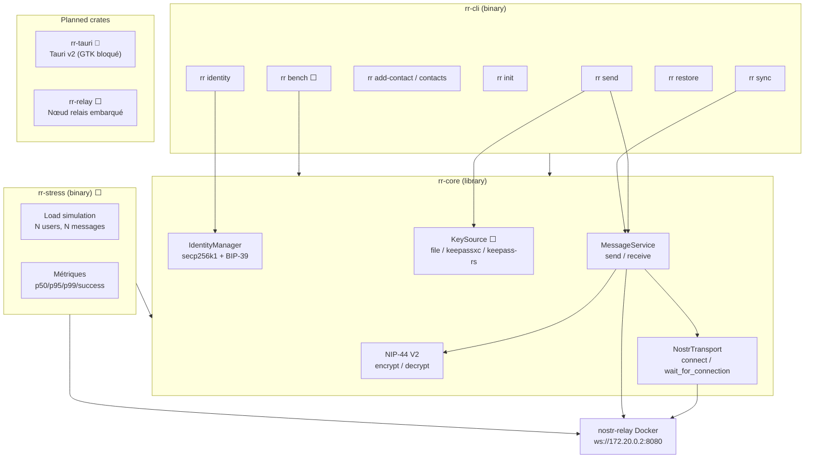

## 2. CLI et routage

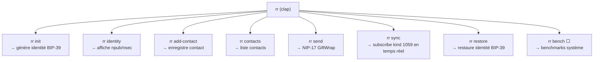

## 3. DevContainer

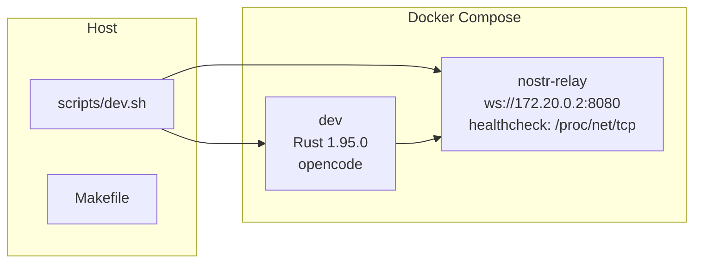

Le container `dev` utilise `127.0.0.53` (systemd-resolved host) au lieu de `127.0.0.11` (DNS Docker) → `nostr-relay` non résolu par nom. Workaround : utiliser l'IP directe `172.20.0.2`.

## 4. CI/CD Pipeline (13 jobs)

```mermaid
graph TD
    subgraph QUALITY["Quality (3)"]
        LINT["lint<br/>fmt + clippy"]
        TEST["test<br/>29 tests"]
        AUDIT["audit<br/>cargo-deny 4/4"]
    end

    subgraph CROSS["Cross-platform (2)"]
        MAC["check-cross macos-latest"]
        WIN["check-cross windows-latest"]
    end

    subgraph BUILD["Build (1)"]
        CLI["build-cli<br/>release + auditable"]
    end

    subgraph SEC["Security (3)"]
        FUZZ["fuzz × 3 targets<br/>NIP-44 roundtrip/decrypt<br/>identity parse"]
        UDEPS["udeps<br/>nightly unused deps"]
        MUTANTS["mutants<br/>test mutation"]
    end

    subgraph METRICS["Metrics (2)"]
        COV["coverage<br/>cargo-llvm-cov"]
        SBOM["sbom<br/>auditable2cdx + upload"]
    end

    subgraph CHECKS["Required checks (8)"]
        R1["lint"] R2["test"] R3["audit"]
        R4["fuzz"] R5["udeps"]
        R6["check-cross (macos)"] R7["check-cross (windows)"]
        R8["build-cli"]
    end

    LINT --> R1
    TEST --> R2
    AUDIT --> R3
    FUZZ --> R4
    UDEPS --> R5
    MAC --> R6
    WIN --> R7
    CLI --> R8
```

## 5. Flux message NIP-17 ✅ (EPIC 1)

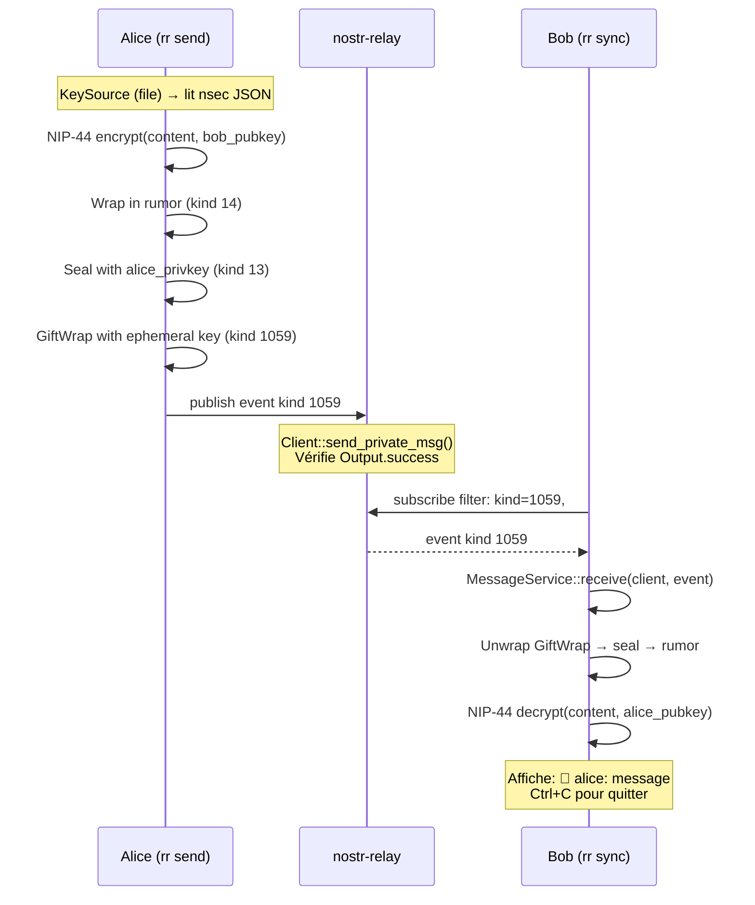

### Décisions architecturales clés

| Décision | Pourquoi |
|----------|----------|
| NIP-17 (pas NIP-04 déprécié) | `send_private_msg` fait rumor→seal→gift wrap en un appel |
| `connect()` fire-and-forget | Background task — nécessite `wait_for_connection(10s)` |
| `Output.success` vérifié | Détecte les relais qui rejettent l'événement |
| `rr sync` sans timeout | Ctrl+C pour quitter (pattern bot.rs) |
| RR_RELAY en env var | YAGNI POC (pas de fichier config) |

## 6. Identity lifecycle

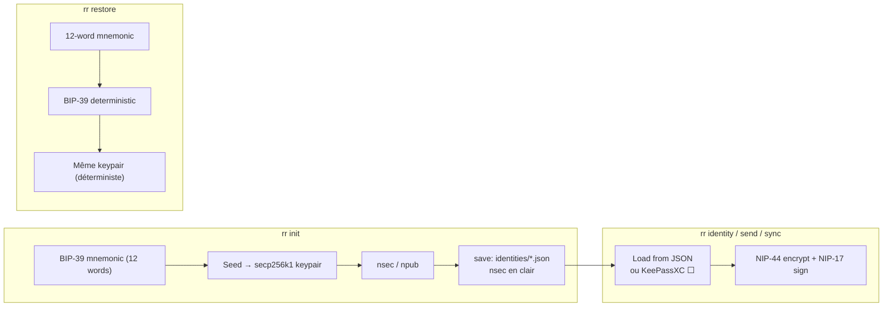

## 7. Vault KeePassXC ⬜ (EPIC 7)

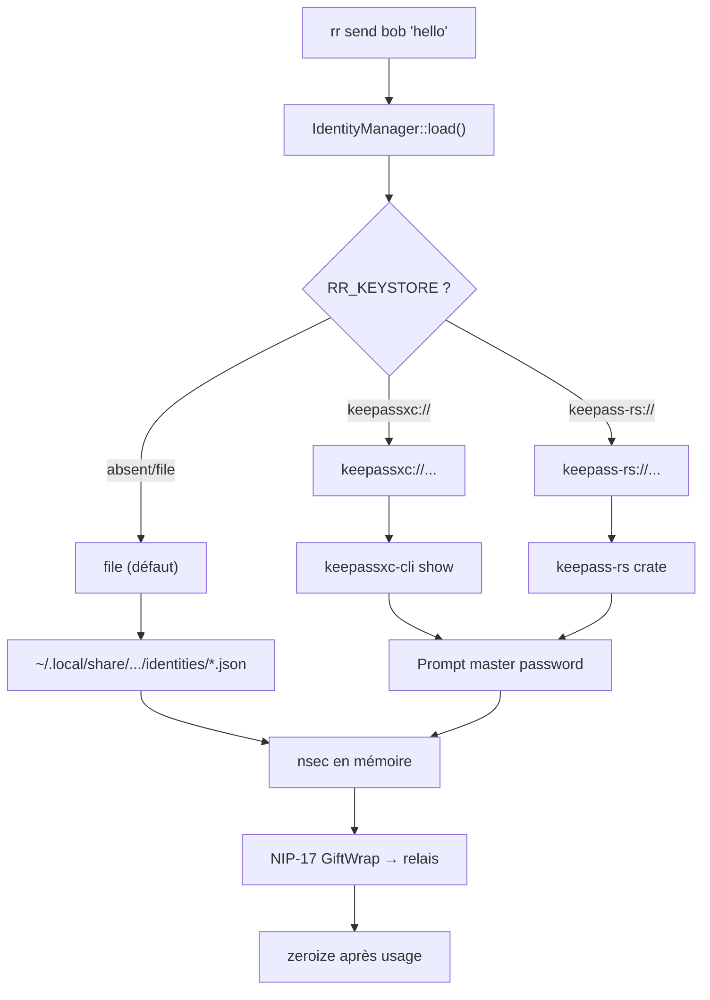

## 8. Benchmarks ⬜ (EPIC 8)

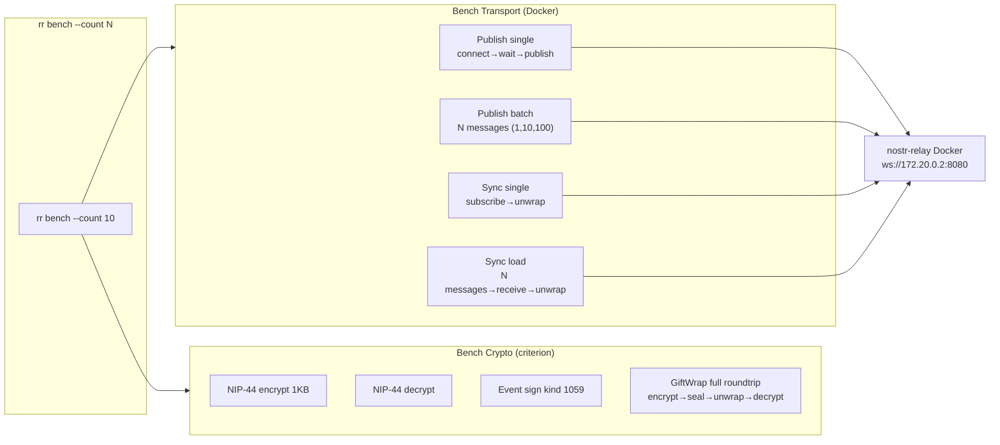

## 9. Simulation charge ⬜ (EPIC 9)

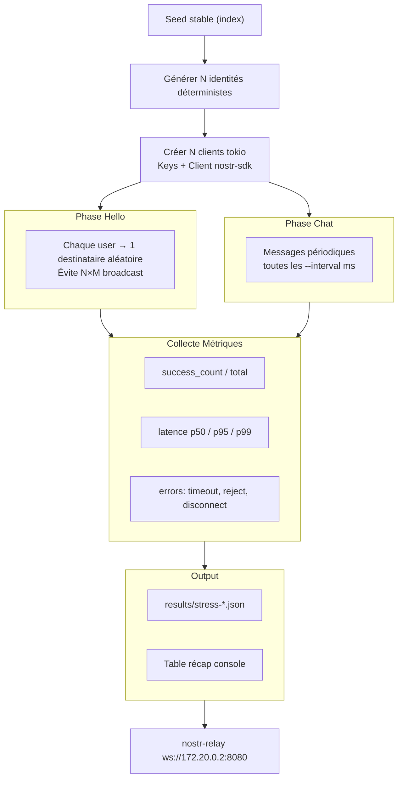

## 10. Fuzz testing

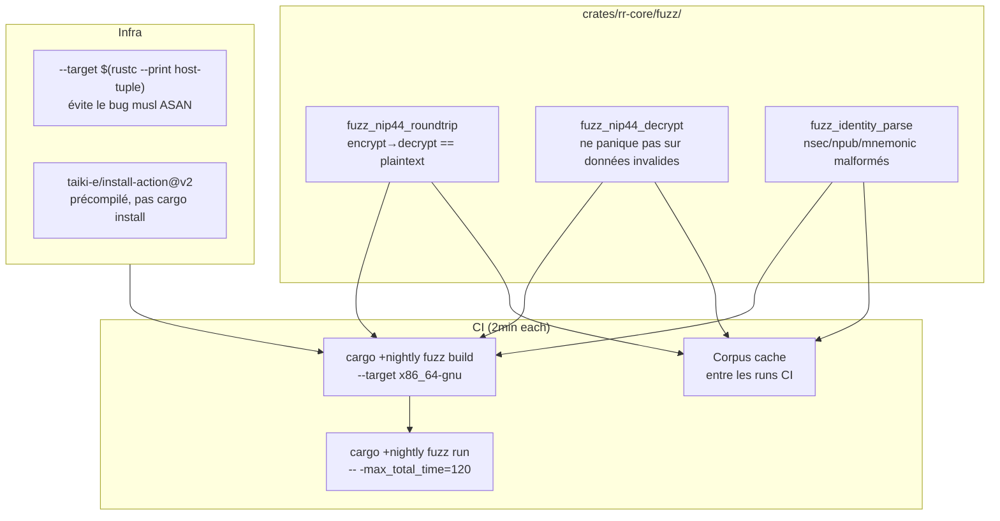

Cf. [cargo-fuzz issue #398](https://github.com/rust-fuzz/cargo-fuzz/issues/398)

## 11. Pre-commit hook

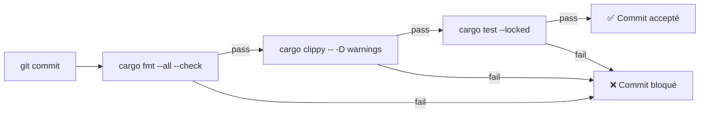

Installation : `make hooks` ou `git config core.hooksPath .githooks`

## 12. Organisation fichiers

```
reseau-racine/
├── .devcontainer/
│   ├── compose.yaml          # dev + nostr-relay
│   ├── Dockerfile            # Rust 1.95.0 + outils
│   └── nostr-relay/
│       └── config.toml       # relay config
├── .githooks/
│   └── pre-commit            # fmt + clippy + test
├── .github/workflows/
│   └── ci.yml                # 13 jobs, 8 status checks
├── crates/
│   ├── rr-cli/
│   │   └── src/main.rs       # clap CLI routing
│   ├── rr-core/
│   │   ├── src/
│   │   │   ├── lib.rs
│   │   │   ├── identity.rs   # IdentityManager, KeySource
│   │   │   ├── message.rs    # MessageService (send/receive)
│   │   │   └── transport/
│   │   │       └── nostr.rs  # NostrTransport
│   │   └── fuzz/
│   │       └── fuzz_targets/ # 3 targets
│   ├── rr-stress/ ⬜          # Load simulation
│   └── rr-tauri/ 🔴           # Tauri v2 (GTK bloqué)
├── docs/
│   ├── ARCHITECTURE.md        # Ce fichier
│   ├── TRACKING.md            # Suivi des EPICs
│   └── superpowers/
│       └── specs/             # Specs approuvées
└── scripts/
    └── dev.sh                 # Wrapper Docker
```

## 13. Modules Rust et dépendances

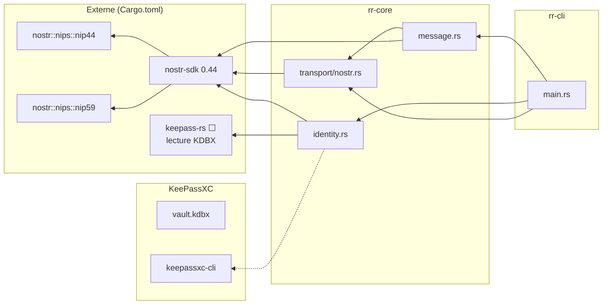

## 14. Planned architecture ⬜ (EPICs 2-6)

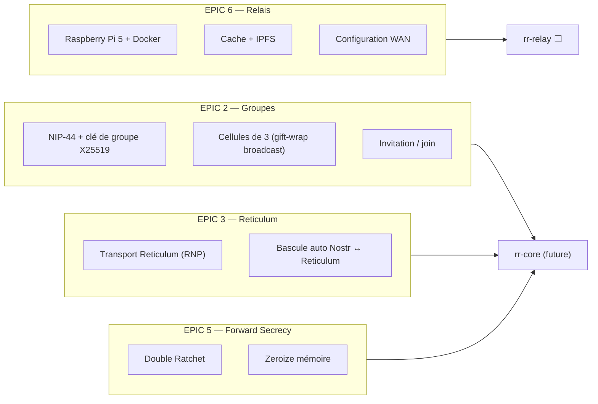
