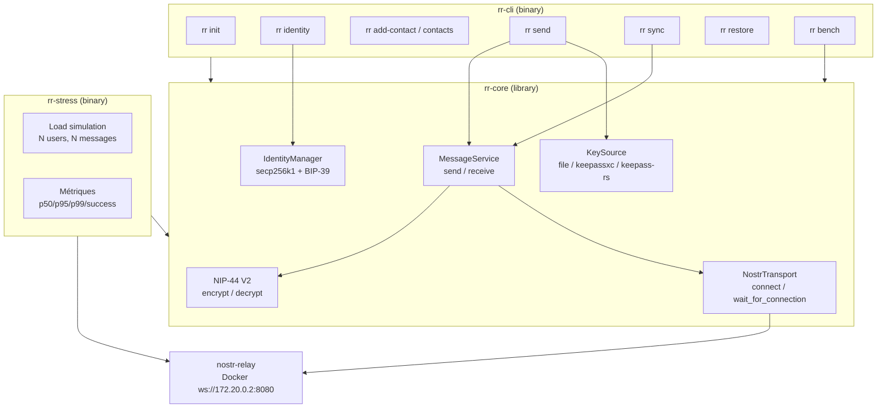
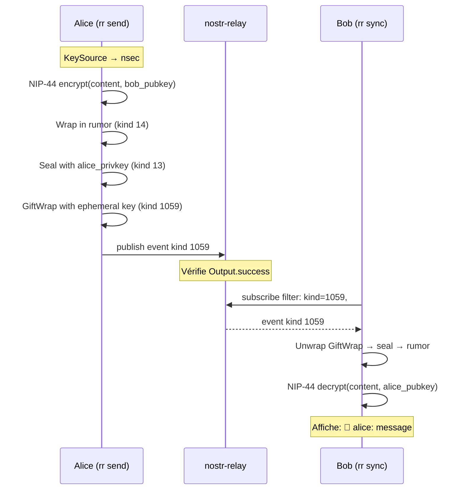
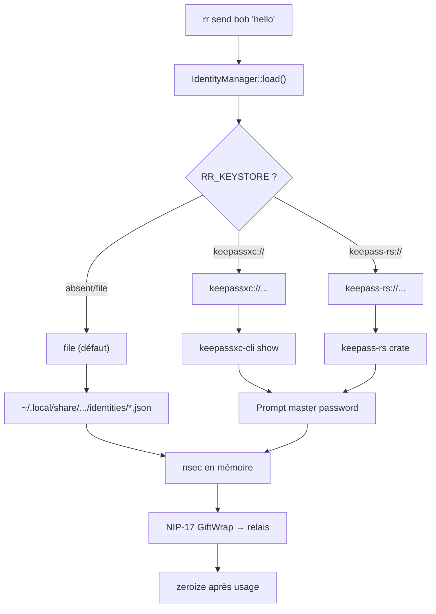
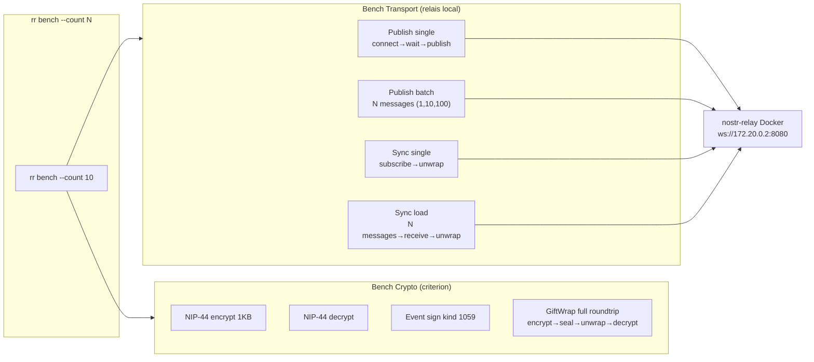
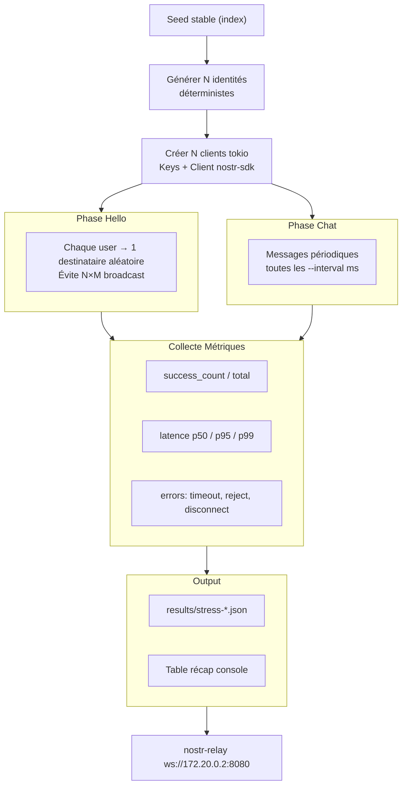
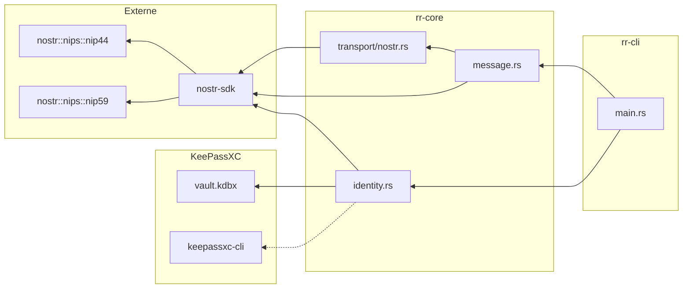

# Architecture Réseau Racine

## Vue d'ensemble



## Flux message NIP-17 (EPIC 1)



## Vault KeePassXC (EPIC 7)



## Benchmarks (EPIC 8)



## Simulation charge (EPIC 9)



## Relations entre modules Rust



## Organisation fichiers

```
reseau-racine/
├── .devcontainer/        # Docker + services
├── .github/workflows/    # CI (13 jobs, 8 status checks)
├── crates/
│   ├── rr-cli/           # CLI binary (9 commandes)
│   ├── rr-core/          # Librairie (crypto, identity, message, transport)
│   │   └── fuzz/         # 3 fuzz targets (NIP-44 roundtrip/decrypt, identity)
│   └── rr-tauri/         # Tauri v2 (build bloqué: GTK)
├── docs/
│   ├── ARCHITECTURE.md   # Ce fichier
│   ├── TRACKING.md       # Suivi des EPICs
│   └── superpowers/
│       ├── specs/        # Specs approuvées
│       └── plans/        # Plans d'implémentation
└── scripts/
    └── dev.sh            # Wrapper Docker
```
