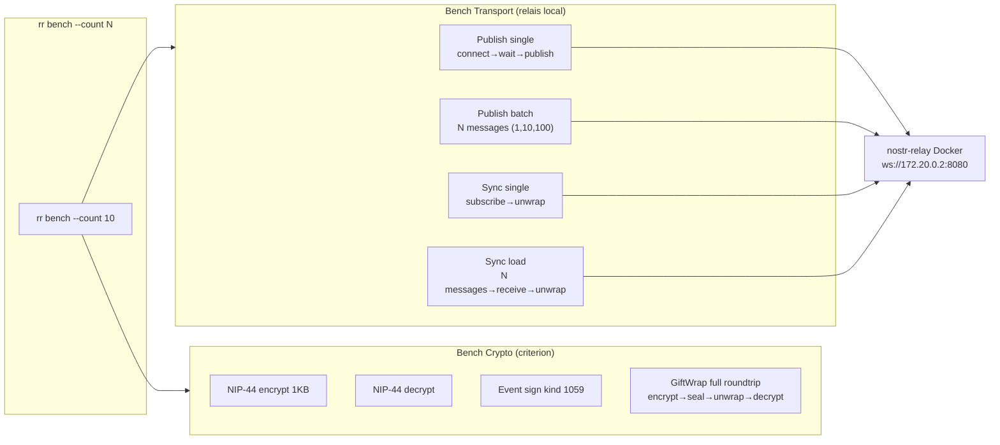

# Performance — Benchmarks système

- **Date :** 2026-05-23
- **Status :** Spec approuvée (brainstorm)
- **Indépendant de :** sécurité (KeePassXC) et stress (simulation charge)

## Problème

Aucune métrique sur les performances réelles :
- Temps d'encrypt NIP-44 + sign + publish NIP-17
- Temps de subscribe + unwrap GiftWrap + decrypt
- Coût de connexion initiale (wait_for_connection)
- Différence relais local vs public

## Architecture



## Solution

Criterion benchmarks dans `crates/rr-core` + sous-commande CLI `rr bench`.

### Benchmarks crypto (unit, sans réseau)

```
cargo bench --bench crypto
```

| Benchmark | Mesure |
|-----------|--------|
| `bench_nip44_encrypt` | Encrypter 1KB message |
| `bench_nip44_decrypt` | Déchiffrer message pré-encrypté |
| `bench_event_sign` | Créer + signer événement kind 1059 |
| `bench_full_roundtrip_crypto` | Encrypt → seal → unwrap → decrypt (GiftWrap complet sans réseau) |

### Benchmarks transport (intégration, relais local Docker)

```
cargo bench --bench transport  # nécessite relais local, pas en CI
```

| Benchmark | Mesure |
|-----------|--------|
| `bench_publish_single` | Connect → wait → publish 1 message NIP-17 |
| `bench_publish_batch` | Connect → wait → publish N messages (1, 10, 100) |
| `bench_sync_single` | Subscribe → attend 1 message → unwrap |
| `bench_sync_load` | Déposer N messages → subscribe → tous recevoir |

### Sous-commande CLI

```
rr bench [--count 10] [--relay ws://172.20.0.2:8080]
```

Output attendu :

```
Benchmark: Crypto pure
  NIP-44 encrypt:     12.4 µs/op
  NIP-44 decrypt:     11.8 µs/op
  Event sign:          8.2 µs/op

Benchmark: Transport (relay=ws://172.20.0.2:8080)
  Publish single:     45.2 ms/op
  Publish batch 10:   38.1 ms/op  (avg)
  Sync single:        52.3 ms/op
  Sync load 100:      48.7 ms/op  (avg)
```

Les benchs transport sont mous (dépendent du relais) — l'intérêt est la comparaison relative.

## Dépendances

- `criterion` (dev-dep) — standard Rust bench
- `rand` (si besoin de payloads aléatoires)

## CI

- Benchmarks crypto en CI (précis, déterministes)
- Benchmarks transport exclus de CI (instables)

## Non-faits

- Pas de flamegraph / profiling — on mesure d'abord
- Pas de bench mémoire (heap usage)
- Pas de bench réseau public — trop de variables

## Critères de succès

- `cargo bench --bench crypto` produit 4 métriques sans erreur
- `rr bench --count 10 --relay ws://172.20.0.2:8080` produit 4 métriques transport sans erreur
