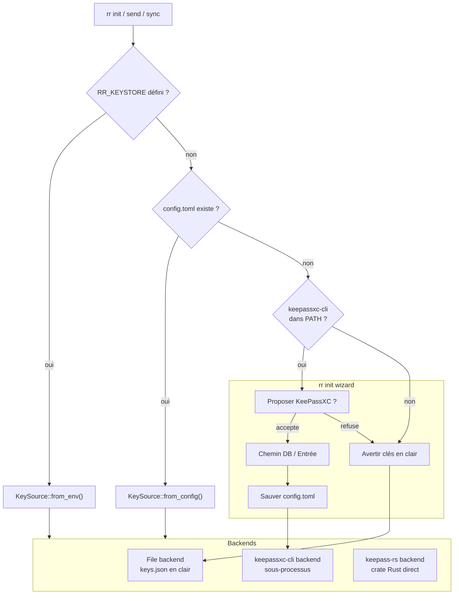

# Sécurité — Vault KeePassXC pour clés Nostr

- **Date :** 2026-05-23 (v2 — workflow complet)
- **Status :** Spec approuvée (brainstorm)
- **Dépend sur :** EPIC 1 (message NIP-17 ✅)
- **EPIC :** 7

## Problème

Les clés Nostr sont stockées dans `~/.local/share/reseau-racine/identities/*.json` en clair. N'importe quel processus ou backup peut les lire. Inacceptable pour un usage réel.

Mais il y a un deuxième problème : le logiciel lui-même n'est pas distribué. L'utilisateur doit installer Docker, cloner le repo, builder Rust. Le premier utilisateur non-dev est bloqué avant même d'arriver aux clés.

## Distribution

### Aujourd'hui

```bash
git clone https://github.com/giak/reseau-racine
cd reseau-racine
# Option 1 : Docker
./scripts/dev.sh cargo build --release --package rr-cli
# Option 2 : natif (si Rust installé)
cargo build --release --package rr-cli
# Binaire : ./target/release/rr
```

### Cible

L'utilisateur non-dev doit pouvoir :

```bash
# Option A : Binaire pré-compilé (recommandé)
curl -LO https://github.com/giak/reseau-racine/releases/latest/download/rr-linux-x86_64
chmod +x rr-linux-x86_64
sudo mv rr-linux-x86_64 /usr/local/bin/rr
rr init

# Option B : Cargo install (si Rust installé)
cargo install reseauracine
rr init

# Option C : Docker (si Docker installé)
docker run ghcr.io/giak/reseau-racine:latest init
```

### CI release

Le job `build-cli` existant compile déjà `--release --package rr-cli`. Il faut :

1. Ajouter un job `release` déclenché sur `git tag v*`
2. Cross-compile pour `x86_64-unknown-linux-gnu`, `aarch64-unknown-linux-gnu`, `x86_64-apple-darwin`, `aarch64-apple-darwin`, `x86_64-pc-windows-msvc`
3. Upload binaires + SBOM (auditable2cdx déjà en CI) vers GitHub Release
4. Package `cargo publish` pour `cargo install reseauracine`

## Workflow utilisateur complet

### Scénario A — Utilisateur sans KeePassXC

```bash
# 1. Installer le binaire
curl -LO ... && chmod +x rr && sudo mv rr /usr/local/bin/rr

# 2. Initialiser
rr init
# → Génère keys.json dans ~/.local/share/reseau-racine/
# → Affiche :
#   ✅ Identité créée : npub1...
#   ⚠️  Clé stockée en clair dans ~/.local/share/reseau-racine/keys.json
#   ⚠️  Pour plus de sécurité, installe KeePassXC et utilise RR_KEYSTORE
#   💡  Voir : https://keepassxc.org

# 3. Utiliser normalement
rr identity
rr add-contact bob npub1...
rr send bob "hello"
rr sync
```

### Scénario B — Utilisateur avec KeePassXC existant

```bash
# 1. Installer rr + avoir KeePassXC installé
# 2. Créer une entrée Nostr dans KeePassXC
#    - Groupe : Nostr
#    - Titre : Identity
#    - Password : nsec généré par rr

# 3. Initialiser avec la DB KeePassXC
rr init --kdbx ~/vault.kdbx --entry Nostr/Identity
# → Détecte keepassxc-cli dans PATH
# → Demande master password (via keepassxc-cli)
# → Génère une identité, la sauvegarde DANS KeePassXC (Password)
# → Crée un fichier de config ~/.config/reseau-racine/config.toml
#   [keystore]
#   type = "keepassxc"
#   db_path = "~/vault.kdbx"
#   entry = "Nostr/Identity"
# → Affiche :
#   ✅ Identité créée et stockée dans KeePassXC
#   ℹ️  Utilise keepassxc-cli pour déverrouiller

# 4. Utiliser (plus besoin de RR_KEYSTORE)
rr send bob "hello"
# → Lit config, voit keepassxc → lance keepassxc-cli
```

### Scénario C — Migration clé existante vers KeePassXC

```bash
# 1. Avoir une identité existante (keys.json)
rr identity
# → npub1abc...

# 2. Exporter vers KeePassXC
rr export --kdbx ~/vault.kdbx --entry Nostr/Identity
# → keepassxc-cli add ~/vault.kdbx Nostr/Identity
# → Password = nsec de l'identité existante

# 3. Basculer
rr init --kdbx ~/vault.kdbx --entry Nostr/Identity
# → Détecte que l'identité existe déjà dans la DB
# → Génère config, ne remplace pas l'existante
```

### Scénario D — Power user avec env vars

```bash
export RR_KEYSTORE=keepassxc://~/vault.kdbx/Nostr/Identity
rr send bob "hi"
# → ignore config, utilise l'env var
```

## Détection et défaut intelligent

```
┌─────────────────────────────────────────────────┐
│ rr init                                         │
├─────────────────────────────────────────────────┤
│ 1. keepassxc-cli dans PATH ?                     │
│    OUI → Proposition interactive :               │
│          "KeePassXC détecté. Utiliser [O/n] ?"   │
│          "Chemin DB [~/vault.kdbx] : "           │
│          "Entrée [Nostr/Identity] : "           │
│          → save config + init dans KeePassXC     │
│                                                  │
│    NON → Avertissement + continuer en file       │
│          "⚠️  KeePassXC non installé."           │
│          "💡  https://keepassxc.org/download"    │
│          "⏎  Continuer sans (clés en clair)..." │
│                                                  │
│ 2. Si --kdbx fourni mais keepassxc-cli absent    │
│    → utilise keepass-rs crate (Rust natif)        │
│    → Pas de prérequis, mais prompt master pwd    │
└─────────────────────────────────────────────────┘
```

## Architecture



## RR_KEYSTORE format

| Valeur | Backend | Exemple |
|--------|---------|---------|
| absent ou `file` | JSON clair | — |
| `keepassxc://<db>/<entry>` | keepassxc-cli | `keepassxc://~/vault.kdbx/Nostr/Identity` |
| `keepass-rs://<db>/<entry>` | keepass-rs | `keepass-rs:///home/user/secrets.kdbx/MyEntry` |

## Fichier de config `~/.config/reseau-racine/config.toml`

```toml
[keystore]
# type = "file" | "keepassxc" | "keepass-rs"
type = "file"

# Pour keepassxc et keepass-rs uniquement :
db_path = "~/vault.kdbx"
entry = "Nostr/Identity"
```

Généré par `rr init --kdbx ...`. Pas de fichier si `type = "file"` (comportement actuel).

Le `type = "file"` dans config.toml est redondant avec l'absence de fichier — mais permet à l'utilisateur de basculer rapidement entre les modes.

## API — Changements dans `rr-core`

```rust
// identity.rs
pub enum KeySource {
    File,
    KeePassXc { db_path: String, entry: String },
    KeePassRs { db_path: String, entry: String },
}

impl KeySource {
    pub fn from_env() -> Self;
    pub fn from_config(path: &Path) -> Option<Self>;
    pub fn detect_keepassxc_cli() -> bool;
}

impl IdentityManager {
    pub fn new(data_dir: impl Into<PathBuf>) -> Self;
    pub fn with_key_source(source: KeySource) -> Self;
    pub fn load(&self) -> Result<Identity, Box<dyn std::error::Error>>;
    pub fn save(&self, identity: &Identity) -> Result<(), Box<dyn std::error::Error>>;
    pub fn save_to_keepassxc(&self, identity: &Identity, db_path: &str, entry: &str) -> Result<()>;
}
```

## Commandes CLI nouvelles / modifiées

### `rr init` — modifié

```
rr init                    → existant, mais avec warning + détection keepassxc
rr init --kdbx <path>      → + crée l'entrée dans KeePassXC + sauve config
rr init --kdbx <path> --entry <entry>
```

### `rr export` — nouvelle

```bash
rr export --kdbx ~/vault.kdbx --entry Nostr/Identity
# Exporte l'identité actuelle vers KeePassXC
```

## Plan d'implémentation

### Phase 1 (immédiat) : Distribution + keystore file uniquement
1. CI release (cross-compile + GitHub Release)
2. `cargo publish` pour `cargo install`
3. Avertissement clés en clair dans `rr init`
4. Fichier `config.toml` basique

### Phase 2 (courte) : Backend keepassxc-cli
5. `KeySource::from_env()` + `load()` → keepassxc-cli
6. `rr init --kdbx` avec création d'entrée
7. `rr export`

### Phase 3 (optionnelle) : Backend keepass-rs
8. Backend Rust natif (sans keepassxc-cli)
9. Prompt master password via rpassword

## Dépendances

- `keepass = "0.12"` (MIT) — KDBX parser Rust
- `rpassword = "7"` — prompt master password (déjà dans le tree)
- `shellexpand = "3"` — expansion `~` dans les chemins
- CI : `taiki-e/upload-rust-binary-action` — cross-compile + GitHub Release

## Non-faits (YAGNI)

- Pas d'intégration OS keychain (keepassxc-cli + kpxc-run couvre)
- Pas de NIP-46 bunker
- Pas de chiffrement au repos Rust natif (c'est le rôle de KeePassXC)
- Pas d'auto-détection de la DB KeePassXC (scan de dossiers)
- Pas de GUI

## Critères de succès

- L'utilisateur installe `rr` via `curl` ou `cargo install` en 1 commande
- `rr init` avertit si les clés sont en clair
- `RR_KEYSTORE=keepassxc://~/vault.kdbx/Nostr/Identity rr send bob "hi"` fonctionne sans stocker la clé en clair
- `rr init --kdbx ~/vault.kdbx` crée l'identité + config + entry dans KeePassXC en une commande
- `rr export --kdbx ~/vault.kdbx --entry Nostr/Identity` migre une identité existante
- Rétro-compatibilité totale : zéro changement pour l'utilisateur actuel
