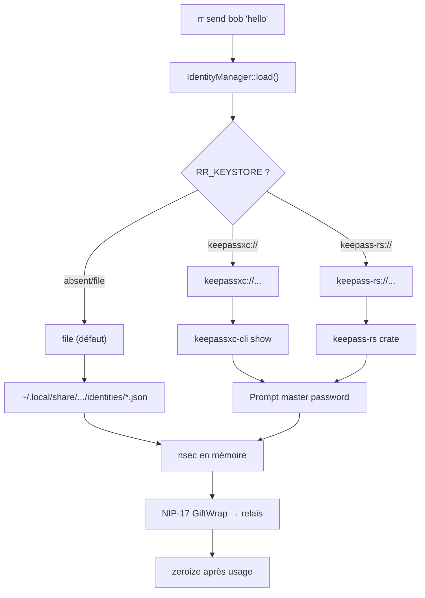

# Sécurité — Vault KeePassXC pour clés Nostr

- **Date :** 2026-05-23
- **Status :** Spec approuvée (brainstorm)
- **Dépend sur :** EPIC 1 (message NIP-17 ✅)
- **Planifié dans :** EPIC 5 (Forward Secrecy) ou nouveau EPIC sécurité

## Problème

Les clés Nostr sont stockées dans `~/.local/share/reseau-racine/identities/*.json` en clair. N'importe quel processus ou backup peut les lire. Inacceptable pour un usage réel.

## Architecture



## Solution

`RR_KEYSTORE` variable d'environnement configure le backend de stockage :

| Valeur | Backend | Dépendance |
|--------|---------|------------|
| `file` | JSON en clair (comportement actuel, défaut) | Aucune |
| `keepassxc://<db_path>/<entry>` | Sous-processus `keepassxc-cli` | keepassxc-cli installé |
| `keepass-rs://<db_path>/<entry>` | Crate Rust `keepass` direct | Rien |

### Backend keepassxc-cli

Appelle `keepassxc-cli show` en sous-processus. Master password demandé sur stdin par keepassxc-cli automatiquement.

```rust
fn get_nsec(db_path, entry) -> Result<SecretKey> {
    let out = Command::new("keepassxc-cli")
        .args(["show", "--quiet", "-s", "-a", "Password", db_path, entry])
        .stdin(Stdio::piped())
        .output()?;
    SecretKey::parse(parse_nsec(out.stdout)?)
}
```

Si l'utilisateur utilise `kpxc-run` ou un keyring OS, le master password est déjà disponible sans reprompt.

### Backend keepass-rs

Crate `keepass` (MIT, active, KDBX3/KDBX4). Ouvre le .kdbx directement en Rust.

```rust
fn get_nsec(db_path, entry) -> Result<SecretKey> {
    let mut file = File::open(db_path)?;
    let password = rpassword::prompt_password("KeePass master password: ")?;
    let key = DatabaseKey::new().with_password(password);
    let db = Database::open(&mut file, key)?;
    let nsec = db.root.children[...]
        .find_entry(|e| e.get_title() == Some(entry))
        .and_then(|e| e.get_password())?;
    SecretKey::parse(nsec)
}
```

### zeroize

Zéroter les clés en mémoire après usage. Si `SecretKey` de `nostr` n'expose pas `secret_bytes()`, wrapper avec `ZeroizeOnDrop`.

## API - Changement dans `rr-core`

```rust
// identity.rs
pub enum KeySource {
    File,
    KeePassXc { db_path: String, entry: String },
    KeePassRs { db_path: String, entry: String },
}

impl IdentityManager {
    pub fn with_key_source(source: KeySource) -> Self;
}
```

## Rétro-compatibilité

- `RR_KEYSTORE` absent → `file` (inchangé)
- `RR_KEYSTORE=file` → inchangé
- `RR_KEYSTORE=keepassxc://~/vault.kdbx/Nostr/Identity` → nouveau comportement

## Dépendances

- `keepass = "*"` (MIT, ~159 stars, actif)
- `rpassword` (déjà dans le tree via nostr-sdk)
- `zeroize` (optionnel, si wrapper nécessaire)

## Non-faits (YAGNI)

- Pas d'intégration OS keychain Rust — keepassxc-cli + kpxc-run couvre déjà
- Pas de NIP-46 bunker — trop lourd pour CLI
- Pas d'agent/serveur en arrière-plan

## Test

```bash
# Test backend keepassxc-cli
RR_KEYSTORE=keepassxc://~/test.kdbx/Nostr/Identity rr send bob "hello"

# Test backend keepass-rs (dans Docker)
RR_KEYSTORE=keepass-rs://~/test.kdbx/Nostr/Identity rr send bob "hello"

# Comportement défaut inchangé
rr send bob "hello"
```

## Critères de succès

- `RR_KEYSTORE=keepassxc://~/vault.kdbx/Nostr/Identity rr send bob "hi"` fonctionne sans stocker la clé en clair sur disque
- `RR_KEYSTORE=keepass-rs://...` identique sans keepassxc-cli
- `RR_KEYSTORE=file` (ou absent) inchangé
