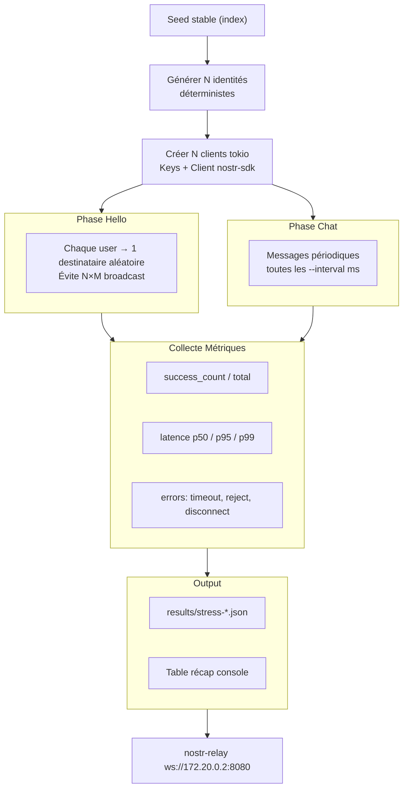

# Scale — Simulation charge massif (rr-stress)

- **Date :** 2026-05-23
- **Status :** Spec approuvée (brainstorm)
- **Dépend sur :** Connaître les perf de base (benchmarks) avant d'interpréter les résultats de stress

## Problème

Comment se comporte nostr-rs-relay avec 50, 100, 500 clients simultanés ? Quels goulets (connexions WebSocket, traitement événements, DB SQLite) ? Peut-on passer à l'échelle ?

## Architecture



## Solution

Binaire séparé `crates/rr-stress/` — outil dev uniquement, pas dans le CLI principal.

### Files

```
crates/rr-stress/
├── Cargo.toml        # dep: nostr-sdk, tokio, serde_json, clap
└── src/main.rs       # orchestration + collecte métriques
```

### Interface CLI

```
cargo run --release --package rr-stress -- \
  --relay ws://172.20.0.2:8080 \
  --users 100 \
  --messages 10 \
  --interval 100ms \
  --output results/stress-2026-05-23.json
```

### Algorithme

```
1. Générer N identités (déterministes, seed stable par index)
2. Créer N clients tokio (chaque client = Keys + Client nostr-sdk)
3. --pre-connect: tous les clients connectés avant la phase d'envoi
4. Phase "Hello":
   - Chaque user envoie 1 message à un destinataire aléatoire
   - Évite la tempête N×M (émetteur vers 1 destinataire par itération)
5. Phase "Chat":
   - Messages périodiques (tick toutes les --interval)
   - Simulation de conversation
6. Collecter stats:
   - success_rate = output.success.count / total
   - latence par message (send → confirmation relais)
   - p50 / p95 / p99
   - Erreurs typées (timeout, relay reject, disconnect)
7. Output JSON + table récap
```

### Paramètres

| Flag | Défaut | Description |
|------|--------|-------------|
| `--users` | 10 | Nombre d'identités simulées |
| `--messages` | 10 | Messages par user |
| `--interval` | 100ms | Délai entre envois |
| `--pre-connect` | true | Connecter tous les clients avant phase 1 |
| `--parallelism` | 4 | Workers tokio concurrents |
| `--output` | stdout | Fichier JSON de sortie |

### Métriques

```json
{
  "phase": "hello",
  "users": 100,
  "total_messages": 10000,
  "success": 9876,
  "failed": 124,
  "latency_ms": { "p50": 12.3, "p95": 45.6, "p99": 89.1 },
  "errors": {
    "timeout": 80,
    "reject": 30,
    "disconnect": 14
  },
  "duration_sec": 5.2,
  "throughput_msg_s": 1923.1
}
```

### Prévision

Le relais `nostr-rs-relay` (single-thread, test) devrait saturer à ~50-100 clients. L'outil valide cette hypothèse et guide le dimensionnement du relais de prod (strfry, etc.).

## Non-faits

- Pas de multi-relais (1 seul relais pour le POC)
- Pas de multi-machine (coordination inter-process)
- Pas de mutation — écriture seule, pas de vérification des événements lus
- Pas de CI (outil dev manuel)

## Dépendances

- `clap` (déjà dans le workspace)
- `nostr-sdk` (déjà)
- `tokio` (déjà)
- `serde_json` (déjà)

## Critères de succès

- `cargo run --package rr-stress -- --users 5 --messages 3` sur relais local produit un JSON valide avec toutes les métriques, sans panique
- `--users 50 --messages 10` complète sans erreur fatale
