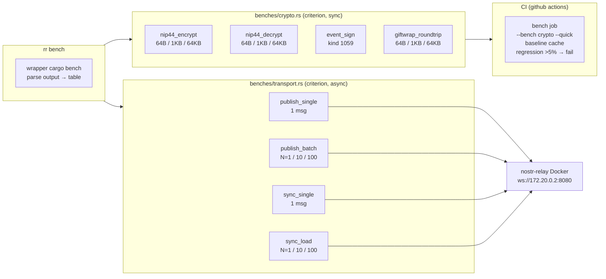

# Performance — Benchmarks système

- **Date :** 2026-05-24
- **Status :** Spec approuvée
- **Indépendant de :** EPIC 7 (KeePassXC) et EPIC 9 (simulation charge)

## Problème

Aucune métrique sur les performances réelles :
- Temps d'encrypt NIP-44 + sign + GiftWrap roundtrip
- Temps de subscribe + unwrap GiftWrap + decrypt
- Coût de connexion initiale (wait_for_connection)
- Différence relais local vs public

Sans mesures, impossible de détecter les régressions de performance ou d'optimiser en connaissance de cause.

## Architecture



## Solution

Criterion v0.8 dans `crates/rr-core/benches/` + wrapper CLI `rr bench`.

### Choix techniques

| Décision | Option retenue | Justification |
|----------|----------------|---------------|
| Framework | criterion v0.8 | HTML reports, détection de régression intégrée, mature |
| Async | `b.to_async(&tokio::runtime::Runtime)` | Support natif criterion v0.3.4+, current_thread pour précision |
| Tailles messages | 64B / 1KB / 64KB | Couvre small/typical/max, Throughput::Bytes pour MB/s |
| `rr bench` | wrapper `cargo bench` | Appelle `cargo bench --bench crypto` parse output |
| — | Pas de flag count | Batch sizes (1/10/100) hardcodées dans criterion. Auto-échantillonnage criterion pour les mesures. |
| CI regression | fail si >5% | `cargo bench` avec baseline, compare au run précédent |

### Crypto benchmarks (`benches/crypto.rs`)

Synchrone, en CI, paramétré par taille avec `BenchmarkGroup` + `Throughput::Bytes`.

| Benchmark | Input | Mesure |
|-----------|-------|--------|
| `nip44_encrypt` | 64B / 1KB / 64KB | temps + MB/s via Throughput::Bytes |
| `nip44_decrypt` | 64B / 1KB / 64KB | temps + MB/s via Throughput::Bytes |
| `event_sign` | kind 1059 | temps |
| `giftwrap_roundtrip` | 64B / 1KB / 64KB | encrypt→seal→unwrap→decrypt (NIP-59 direct, synchrone) |

Les 3 tailles sont benchmarkées dans un `BenchmarkGroup` avec `Throughput::Bytes` pour que criterion calcule le débit. L'output inclut à la fois le temps/op et le MB/s.

Le GiftWrap roundtrip n'a pas besoin d'être async : il utilise les fonctions NIP-59 (crypto pure, pas de réseau).

```rust
use criterion::{black_box, BenchmarkId, Criterion, Throughput};

fn bench_nip44_encrypt(c: &mut Criterion) {
    let (alice, bob) = setup_keys();
    let mut group = c.benchmark_group("nip44_encrypt");
    for size in [64u64, 1024, 65535] {
        let msg = vec!['A' as u8; size as usize].into_iter().collect::<String>();
        group.throughput(Throughput::Bytes(size));
        group.bench_with_input(
            BenchmarkId::from_parameter(size),
            &msg,
            |b, m| b.iter(|| CryptoProvider::encrypt(
                black_box(alice.secret_key()),
                black_box(&bob.public_key()),
                black_box(m),
            ))
        );
    }
    group.finish();
}
```

Le pattern est identique pour `nip44_decrypt` (avec un ciphertext pré-encrypté pour chaque taille) et `giftwrap_roundtrip` (NIP-59 compose les 4 opérations sans réseau).

`event_sign` n'est pas paramétré par taille (le payload kind 1059 est fixe).

### Transport benchmarks (`benches/transport.rs`)

Async, pas en CI, nécessite relais local Docker opérationnel.

| Benchmark | Setup | Mesure |
|-----------|-------|--------|
| `publish_single` | connexion établie, publish 1 msg | temps publish uniquement |
| `publish_batch` | connexion établie, publish N=1/10/100 | temps total / temps moyen par msg |
| `sync_single` | connexion établie, subscribe + wait 1 msg + unwrap | temps |
| `sync_load` | déposer N=1/10/100 msgs en setup → subscribe → tous recevoir | temps total / temps moyen par msg |

La connexion au relais (`wait_for_connection`) est faite une fois dans le setup, pas dans la boucle de mesure. Les benchmarks transport utilisent `b.to_async()` avec un `tokio::runtime::Runtime` partagé. Le temps de cold-start complet (connect + publish) n'est pas mesuré — en production la connexion est persistante.

`sync_load` dépose N messages via publish pendant le setup, puis subscribe pour tous les recevoir. Le temps de dépôt n'est pas mesuré.

Pattern async :
```rust
use criterion::Criterion;
use tokio::runtime::Runtime;

fn bench_publish(c: &mut Criterion) {
    let rt = Runtime::new().unwrap();
    let (client, receiver) = rt.block_on(setup_transport());
    c.bench_function("publish_single", |b| {
        b.to_async(&rt).iter(|| publish_msg(&client, &receiver))
    });
}
```

### Sous-commande CLI `rr bench`

Wrapper dans `crates/rr-cli/src/main.rs` qui appelle `cargo bench` et parse l'output.

```
rr bench [--crypto-only | --transport-only] [--relay <URL>]
  --crypto-only       Benchmarks crypto uniquement (équivaut à cargo bench --bench crypto)
  --transport-only    Benchmarks transport uniquement (équivaut à cargo bench --bench transport)
  --relay <URL>       Relais pour transport (défaut: ws://172.20.0.2:8080)
```

Par défaut (sans flag) : les deux benchmarks s'exécutent. Le transport est skip si le relais est injoignable (timeout 2s). Les batch sizes transport (1/10/100) sont définies dans le code criterion, pas configurables par CLI — on garde simple.

Le transport bench lit `RR_RELAY` dans l'environnement (défaut: `ws://172.20.0.2:8080`). `rr bench --relay` définit `RR_RELAY` dans le sous-processus.

Implémentation :
1. Appelle `cargo bench --bench crypto -- --output-format bencher` via `std::process::Command`
2. Si transport, définit `RR_RELAY` et appelle `cargo bench --bench transport -- --output-format bencher`
3. Parse l'output text format bencher (times + unités)
4. Si transport demandé mais relais injoignable (timeout 2s), skip avec message
5. Affiche un tableau formaté :

```
Benchmark: Crypto pure (via criterion)
  nip44_encrypt/64        12.4 µs    4.9 GB/s
  nip44_encrypt/1024      14.2 µs   68.7 MB/s
  nip44_encrypt/65535     182  µs  343.0 MB/s
  nip44_decrypt/64        11.8 µs    5.2 GB/s
  nip44_decrypt/1024      13.1 µs   74.5 MB/s
  nip44_decrypt/65535     168  µs  372.0 MB/s
  event_sign               8.2 µs
  giftwrap_roundtrip/64   42.1 µs    1.5 GB/s
  giftwrap_roundtrip/1024 45.3 µs   21.6 MB/s
  giftwrap_roundtrip/65535 312 µs  200.0 MB/s

Benchmark: Transport (relay=ws://172.20.0.2:8080)
  publish_single           45.2 ms/op
  publish_batch/10         38.1 ms/op  (avg)
  sync_single              52.3 ms/op
  sync_load/10             48.7 ms/op  (avg)
```

Les benchs transport sont mous (dépendent du relais Docker) — l'intérêt est la comparaison relative entre runs sur le même environnement.

## CI

Nouveau job `bench` dans `.github/workflows/ci.yml` :

```yaml
bench:
  name: bench
  runs-on: ubuntu-latest
  steps:
    - uses: actions/checkout@v4
    - uses: dtolnay/rust-toolchain@stable
    - uses: swatinem/rust-cache@v2
    - name: Restore baseline cache
      uses: actions/cache@v4
      with:
        path: target/criterion
        key: bench-crypto-${{ github.sha }}
        restore-keys: bench-crypto-
    - run: cargo bench --bench crypto -- --quick --output-format bencher
```

- `--quick` : nombre d'itérations réduit pour CI (précision moindre, mais suffisant pour régression)
- `--output-format bencher` : output lisible par des outils
- Baseline stockée dans le cache GitHub Actions (`target/criterion`)
- La clé de cache inclut `${{ github.sha }}` pour le run actuel, avec fallback sur le run précédent
- Si régression >5% sur un benchmark → `cargo bench` exit non-zero → job fail → PR bloquée
- Pas de bench transport en CI (nécessite relais Docker)

Note : le cache des baselines permet la comparaison entre runs. Le premier run sur une branche n'a pas de baseline → crée la baseline. Les runs suivants comparent.

## Dépendances

```toml
# crates/rr-core/Cargo.toml
[dev-dependencies]
criterion = { version = "0.8", features = ["html_reports", "async_tokio"] }

[[bench]]
name = "crypto"
harness = false

[[bench]]
name = "transport"
harness = false
```

## Fichiers modifiés / créés

| Fichier | Action | Contenu |
|---------|--------|---------|
| `crates/rr-core/Cargo.toml` | Modifier | Ajouter criterion dev-dep + [[bench]] sections |
| `crates/rr-core/benches/crypto.rs` | Créer | 4 benchmarks crypto avec 3 tailles |
| `crates/rr-core/benches/transport.rs` | Créer | 4 benchmarks transport async |
| `crates/rr-cli/src/main.rs` | Modifier | Ajouter subcommand Bench avec --crypto-only/--transport-only/--relay |
| `.github/workflows/ci.yml` | Modifier | Ajouter job bench |

## Non-faits

- Pas de profiling / flamegraph — on mesure d'abord
- Pas de bench mémoire (cachegrind/valgrind)
- Pas de bench réseau public — trop de variables
- Pas de Divan — tout criterion pour cohérence CI

## Critères de succès

1. `cargo bench --bench crypto` → 10 métriques (3 benchmarks × 3 sizes + event_sign × 1) avec Throughput MB/s
2. `cargo bench --bench transport` → 4 métriques sur relais local Docker
3. `rr bench` → output formaté en tableau, pas d'erreur
4. `rr bench --crypto-only` → seulement les métriques crypto
5. CI job `bench` tourne, baseline sauvegardée dans cache
6. Régression >5% sur un bench crypto → exit non-zero → CI rouge → PR bloquée
